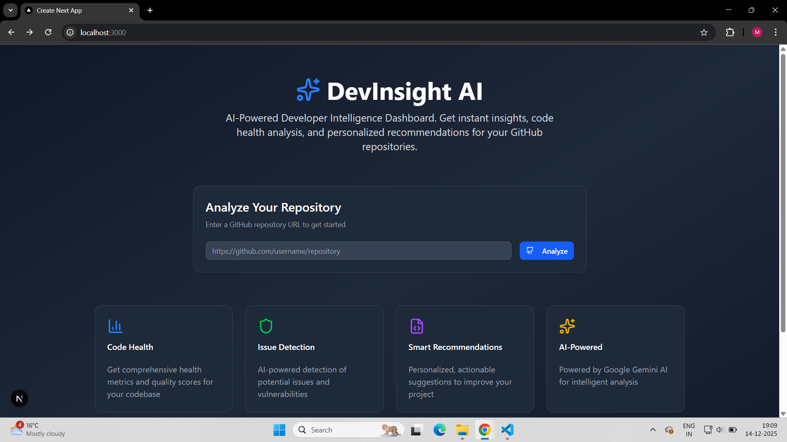

# DevInsight AI Dashboard 

AI-Powered Developer Intelligence Dashboard for GitHub repositories

## Features

- **AI Code Analysis**: Powered by Google Gemini AI
- **Health Scoring**: Comprehensive code health metrics
- **Issue Detection**: AI-powered issue identification
- **Smart Recommendations**: Personalized improvement suggestions
- **Real-time Dashboard**: Beautiful visualization of analysis results

## Tech Stack

- **Frontend**: Next.js 16, React 19, TypeScript, Tailwind CSS
- **Backend**: Next.js API Routes, Prisma ORM
- **Database**: Neon (Serverless PostgreSQL)
- **AI**: Google Gemini AI, Groq (Llama 3)
- **APIs**: GitHub Octokit, REST API
- **Deployment**: Vercel
- **Code Review**: CodeRabbit

##  Hackathon Technologies Used

-  **Vercel** - Serverless deployment
-  **CodeRabbit** - AI code reviews
-  **Kestra** - Planned for workflow orchestration
-  **Oumi** - Planned for fine-tuned recommendations
-  **Cline** - Planned for CLI automation

##  Quick Start

\`\`\`bash
# Install dependencies
npm install

# Setup environment variables
cp .env.example .env.local

# Run database migrations
npx prisma db push

# Start development server
npm run dev
\`\`\`

Visit http://localhost:3000

##  Demo

## 👥 Team

Built by coders for WeMakeDevs Hackathon